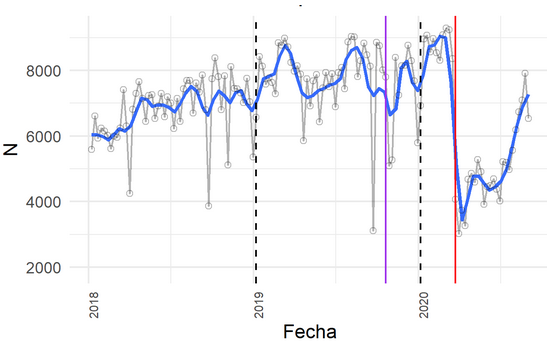
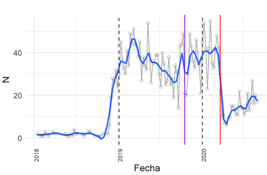
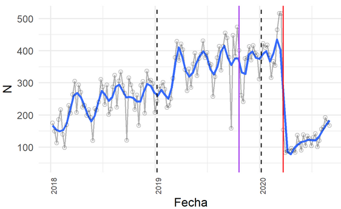
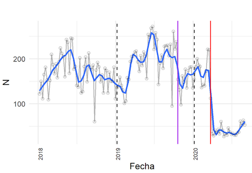
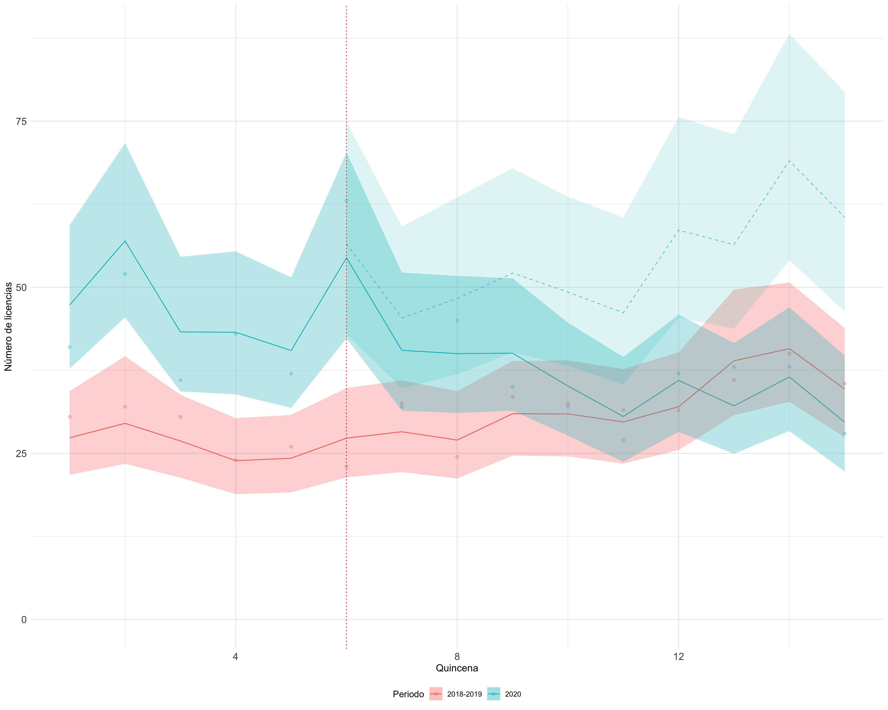
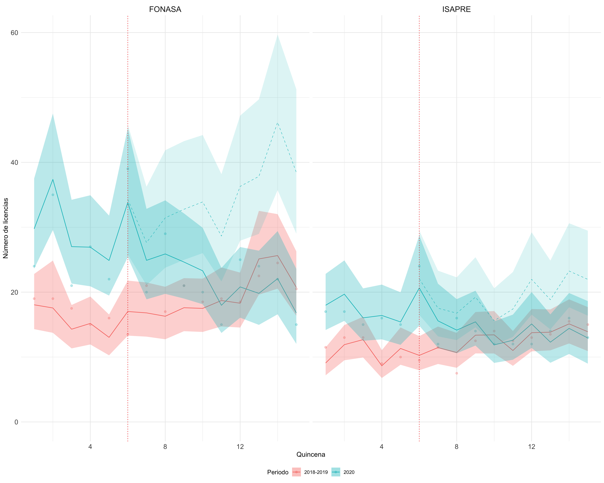
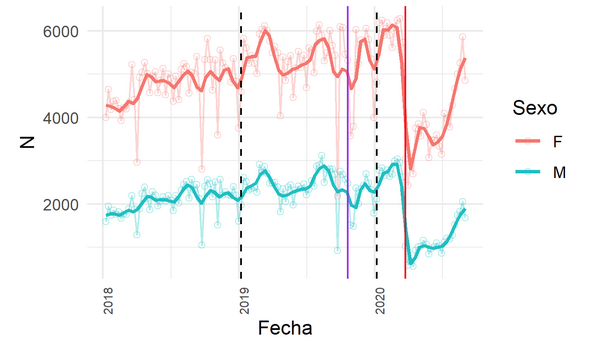
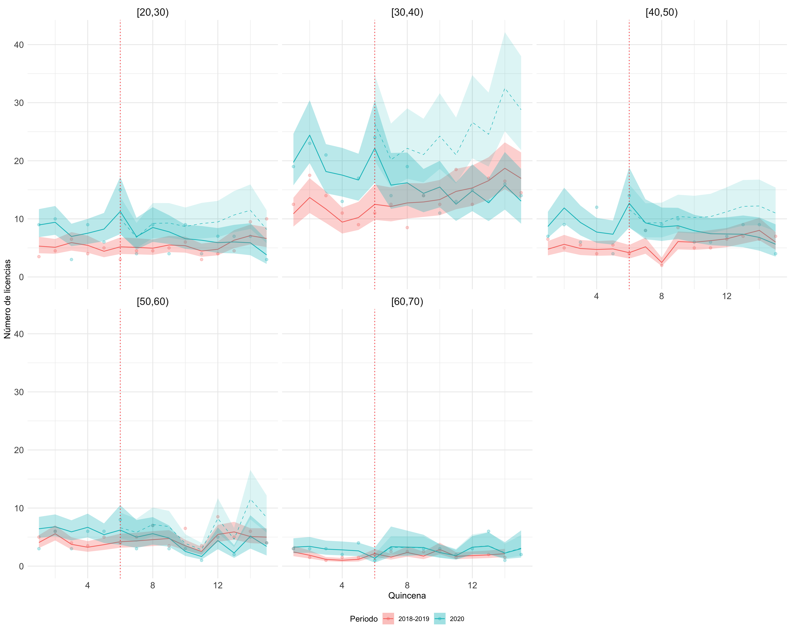
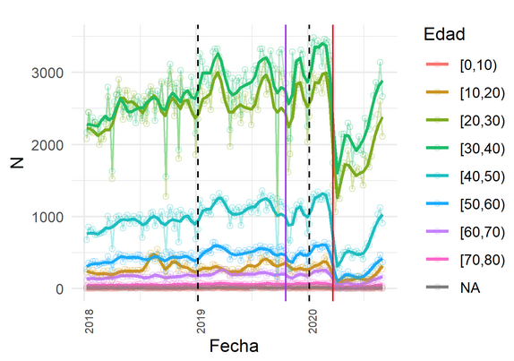

```{r setup, include=FALSE}
#Chunk options
knitr::opts_chunk$set(echo = TRUE, warning = FALSE, message= FALSE)

#Globalsetting
options(OutDec= "," , digits = 3, scipen = 3)
#UTF
Sys.setlocale("LC_ALL", "ES_ES.UTF-8")
```

```{r, include=FALSE, message=FALSE, warning=FALSE}
pacman::p_load(dplyr,
               kableExtra,
               knitr,
               readxl)

######Cargar base de datos####
# Cargar casos y muertos
anexo1 <- read.csv("https://raw.githubusercontent.com/CoV-IMPACT-C/acceso-vih/main/input/anexo.csv", sep = ";")
```

<br><left><p style="line-height: 2em;" ><font size="3"><span style="color: #033C73">
**Cristóbal Cuadrado** <br>
**Sandra Flores** <br>
**Francisca Vidal**
<left><p style="line-height: 2em;" ><font size="2.5"><span style="color: #033C73">
Escuela de Salud Pública <br>
Universidad de Chile <br></span></font>
<span style="color: #343a40"><font size="2.5"></font> </span>
</p></left><br>

# Antecedentes

Hasta el día 1 de Diciembre, la pandemia COVID-19 en Chile ha producido 552.864 personas contagiadas y 15.430 personas fallecidas (MINSAL, 2020). Estudios internacionales han relevado el impacto de la pandemia en el acceso a servicios de salud (Baum, Schwartz., 2020; Diegoli et al, 2020). En el caso de Chile, estudios indican que ha existido una fuerte caída en el acceso a atención en general (COLMED, 2020), particularmente grave para enfermedades severas como cánceres, infartos o accidentes cerebrovasculares, donde las mujeres han sido más afectadas (Pacheco et al., 2020). Este fenómeno puede producirse por varios mecanismos, siendo los principales el temor al contagio en los centros de salud y la suspensión de horas médicas por parte de los centros de salud (MOVID-19).

En este contexto, fruto de la colaboración entre IMED, CENS y la Escuela de Salud Pública de la Universidad de Chile, desarrollamos un estudio para analizar de manera pormenorizada el acceso a servicios ambulatorios de salud vinculadas al diagnóstico y atención de VIH/SIDA, junto a las licencias médicas electrónicas relacionadas a esta enfermedad. Para ello, utilizamos como fuente de información los datos de bonos electrónicos de prestadores privados de salud de IMED, cuya cobertura representa aproximadamente un 80% del total de atenciones ambulatorias en prestadores privados en el país. Los datos disponibles corresponden al período comprendido entre el 1 de enero de 2018 y el 30 de agosto de 2020, contando con información para 10.331.939 personas. Las características de la población en estudio se encuentran disponibles en la tabla de anexos.

Este estudio se enmarca en el trabajo del proyecto CoV-IMPACT-C “Impacto del COVID-19 en Chile: una evaluación transdisciplinaria de la respuesta a la pandemia y sus consecuencias”, financiado por la Agencia Nacional de Investigación y Desarrollo (ANID Proyecto  N° COVID0960).

# El VIH en Chile

La infección por el Virus de Inmunodeficiencia Humana (VIH) ha mostrado un incremento importante en los últimos años en el país, mostrando un patrón preocupante, particularmente en población más jóven. El acceso a un diagnóstico precoz que permita a la población viviendo con VIH conocer su estado y acceder a tratamientos efectivos es la estrategia más importante para poder reducir la incidencia de nuevos contagios a nivel poblacional. Así mismo, mantener un control estable es fundamental para monitorear la efectividad de la terapia en la supresión de carga viral que permite reducir las complicaciones asociadas a la infección y reducir el riesgo de transmisión a otras personas. En este contexto, conocer el impacto de la pandemia en el acceso a prestaciones vinculadas con el diagnóstico y cuidado de VIH en el país resulta fundamental para comprender las posibles consecuencias sobre la evolución de la epidemia de VIH en el país.

## Test diagnóstico V.I.H. (ELISA)
Los test de ELISA son utilizados para el diagnóstico de VIH. De esta manera, son fundamentales para la detección precoz de la infección, utilizándose de manera habitual para el tamizaje poblacional y en grupos de riesgo, cuestión fundamental para la estrategia de control. 

Los test de ELISA presentan una fuerte caída a partir de la semana del 15 de marzo, cuando comienzan a imponerse las restricciones asociadas a la pandemia COVID-19. En la figura 1 observamos que antes de la pandemia se realizaron más de 8 mil test semanales ambulatorios en prestadores privados, los cuales caen a menos de 4 mil inmediatamente después del 15 de marzo, esto es una variación de casi un 50%. Entre el 15 de marzo y 30 de agosto de 2020, en promedio, se realizaron 1143,8 test de ELISA menos por semana, representando una caída de 15,5% semanal. Con lo anterior, estimamos un total de 27451 test de ELISA no realizados en el periodo.  

**Test de diagnóstico V.I.H. (ELISA)**


<br><font size="2.5"><p style="line-height: 0.8em;">*Figura 1.* Número de test de ELISA semanales realizados por prestadores privados entre enero de 2018 y agosto de 2020. En azul se presenta la tendencia promedio semanal suavizada. Los puntos grises representan el total de prestaciones semanales observadas. La línea roja vertical indica el 15 de marzo 2020. La línea lila vertical indica el 18 de octubre 2019. Las líneas negras punteadas verticales indican el 31 de diciembre de cada año.</font></p>
<br><br></left>

Carga Viral VIH  
La carga viral de VIH es un examen utilizado en el contexto del seguimiento de la terapia antirretroviral de personas viviendo con VIH para evaluar la efectividad del tratamiento y la eventual necesidad de cambios en dicha terapia, siendo solicitado habitualmente cada 6 meses a pacientes estables. De esta manera, es un buen marcador de la continuidad de la atención crónica entre personas viviendo con VIH. 

Al igual que en los tests de diagnóstico, se observa una reducción en los exámenes de carga viral debido a la pandemia. En promedio, antes de la pandemia se realizaban aproximadamente 40 exámenes semanales, disminuyendo a menos de 10 inmediatamente después del 15 de marzo. Cabe destacar que la codificación para esta prestación comienza de manera sistemática en 2019, por lo cual observamos un número muy menor de exámenes en 2018.

**Exámenes de carga viral**


<br><font size="2.5"><p style="line-height: 0.8em;">*Figura 2.*Número de exámenes de carga viral semanales realizados por prestadores privados entre enero de 2018 y agosto de 2020. En azul se presenta la tendencia promedio semanal suavizada. Los puntos grises representan el total de prestaciones semanales observadas. La línea roja vertical indica el 15 de marzo 2020. La línea lila vertical indica el 18 de octubre 2019. Las líneas negras punteadas verticales indican el 31 de diciembre de cada año. Nota: La codificación para esta prestación comienza de manera sistemática desde el año 2019.
</font></p>
<br><br></left>

## Consulta médica de especialidad en infectología

Las consultas médicas de especialidad en infectología experimentaron una caída semanal promedio de 25,7% entre marzo y agosto de 2020, comparado al mismo periodo de 2018 y 2019. En promedio, se realizaron 159,6 consultas menos por semana, con un total de 3831 consultas no realizadas en el periodo. Si bien no es posible vincular estas consultas directamente al cuidado de personas viviendo con VIH, la especialidad corresponde a la que habitualmente entrega cuidados a este tipo de pacientes.

**Consultas médicas de especialidad en infectología semanales (código 101898)*** 



<br><font size="2.5"><p style="line-height: 0.8em;">*Figura 3.* Número de consultas médicas de especialidad en infectología semanales (código 101898) realizadas por prestadores privados entre enero de 2018 y agosto de 2020. En azul se presenta la tendencia promedio semanal suavizada. Los puntos grises representan el total de prestaciones semanales observadas. La línea roja vertical indica el 15 de marzo 2020. La línea lila vertical indica el 18 de octubre 2019. Las líneas negras punteadas verticales indican el 31 de diciembre de cada año.</font></p>
<br><br></left>

**Consultas de enfermedades infecciosas semanales (código 101843)**



<br><font size="2.5"><p style="line-height: 0.8em;">*Figura 4.* Número de consultas de enfermedades infecciosas semanales (código 101843) realizadas por prestadores privados entre enero de 2018 y agosto de 2020. En azul se presenta la tendencia promedio semanal suavizada. Los puntos grises representan el total de prestaciones semanales observadas. La línea roja vertical indica el 15 de marzo 2020. La línea lila vertical indica el 18 de octubre 2019. Las líneas negras punteadas verticales indican el 31 de diciembre de cada año.
</font></p>
<br><br></left>


# Acceso a licencias médicas electrónicas

Para el análisis de licencias médicas electrónicas por VIH/SIDA nos enfocamos en los pacientes con licencias con los siguientes códigos CIE-10: VIH (B24), Kaposi (C46), Neumonía por Pneumocystis (B59), Toxoplasmosis (B58), Leucoencefalopatia multifocal progresiva (A81.2). Para estos pacientes, analizamos todas las licencias aprobadas en el periodo de estudio (enero de 2018 y 16 de agosto de 2020), independiente del diagnóstico.

La figura 5 presenta los resultados de un modelo de serie de tiempo interrumpida, que permite estimar cuántas licencias se habrían entregado entre marzo y agosto de 2020 en un escenario sin pandemia. Observamos que 2020 (en verde) comienza con más licencias médicas por VIH/SIDA que el promedio de 2018 y 2019 (en rojo), y que a partir del 15 de marzo las licencias de 2020 disminuyen, llegando a niveles similares a 2018 y 2019. Estimamos que en el periodo afectado por la pandemia se dejaron de entregar 167 licencias por VIH/SIDA (95% CI 127 - 222). Este número es un 31% del total de licencias por VIH/SIDA que se habrían entregado entre el 15 de marzo y 15 de agosto de 2020 en el escenario sin pandemia de acuerdo a nuestro modelo.

**Licencias médicas electrónicas por VIH/SIDA**



<br><font size="2.5"><p style="line-height: 0.8em;">*Figura 5.* Número de licencias médicas electrónicas por VIH/SIDA por quincena, entre el 1 de enero y 15 de agosto de 2018, 2019 y 2020. Las líneas continuas muestran los valores estimados con el modelo de serie de tiempo interrumpida. Los puntos representan el total de licencias médicas electrónicas semanales observadas. En rojo, se presenta el promedio de 2018 y 2019 y en verde 2020. La línea verde punteada muestra el contrafactual estimado para el periodo afectado por la pandemia (a partir del 15 de marzo de 2020). La línea roja vertical indica el 15 de marzo. 
</font></p>
<br><br></left>

Los resultados por tipo de previsión se presentan en la Figura 6. Observamos más licencias para pacientes VIH/SIDA en FONASA que en ISAPRE. En el periodo afectado por la pandemia estimamos que se dejaron de entregar 117 licencias semanales (95% CI 90 - 153) en FONASA y 50 licencias (95% CI 39-62) en ISAPRE a personas viviendo con VIH. Respecto a la estimación del total de licencias entre 15/03 y 15/08 en el escenario sin pandemia, la caída en el número de licencias FONASA fue de 34% y de 26% para ISAPRE.

**Licencias médicas electrónicas por VIH/SIDA por tipo de previsión**



<br><font size="2.5"><p style="line-height: 0.8em;">*Figura 6*. Número de licencias médicas electrónicas por VIH/SIDA por quincena entre el 1 de enero y 15 de agosto de 2018, 2019 y 2020, por tipo de previsión (FONASA e ISAPRE). Las líneas continuas muestran los valores estimados con el modelo de serie de tiempo interrumpida. Los puntos representan el total de licencias médicas electrónicas semanales observadas. En rojo, se presenta el promedio de 2018 y 2019 y en verde 2020. La línea verde punteada muestra el contrafactual estimado para el periodo afectado por la pandemia (a partir del 15 de marzo de 2020). La línea roja vertical indica el 15 de marzo. </font></p>
<br><br></left>

# ¿Ha afectado diferencialmente a hombres y mujeres?

En otros estudios que hemos realizado en el contexto de CoV-IMPACT-C (Pacheco, 2020; Cuadrado, 2020), observamos que la pandemia ha afectado diferencialmente a hombres y mujeres, con una mayor reducción en el número de prestaciones en las mujeres. Sin embargo, en el contexto de las prestaciones vinculadas a la atención del VIH vemos un mayor impacto en hombres.

En particular, observamos una mayor reducción en el número de test de ELISA en hombres que en mujeres. Esta prestación disminuyó un 26% semanal promedio para hombres entre marzo y agosto de 2020, en comparación al promedio de 2018 y 2019. En cambio, la disminución promedio semanal es de un 10% para mujeres. En términos absolutos, entre marzo y agosto de 2020 se dejaron de realizar 607 tests promedio por semana en el caso de los hombres, con un total de 14563 aproximados en el periodo. Para las mujeres, la reducción promedio semanal fue de 537 y de 12888 en total.  

**Test de ELISA por sexo**



<br><font size="2.5"><p style="line-height: 0.8em;">*Figura 7*. Número de test de ELISA semanales realizados por prestadores privados entre enero de 2018 y agosto de 2020 por sexo. Se presenta la tendencia promedio semanal suavizada en verde para hombres y rojo para mujeres. Los puntos representan el total de prestaciones semanales observadas. La línea roja vertical indica el 15 de marzo 2020. La línea lila vertical indica el 18 de octubre 2019. Las líneas negras punteadas verticales indican el 31 de diciembre de cada año.</font></p>
<br><br></left>

# El impacto sobre la población más jóven

Como hemos comentado, la epidemia de VIH en Chile ha afectado de mayor forma a la población de grupos de edad más jóvenes. En el contexto de la pandemia, observamos que el grupo de personas viviendo con VIH en que cae de manera más importante el acceso a licencias médicas fue  la población entre 30 y 40 años. Así mismo, las personas entre 20 y 40 años fueron las que más redujeron la realización de exámenes diagnósticos (test de ELISA). Este es, precisamente, el grupo de mayor riesgo de contraer la infección y transmitirla otras personas.

**Licencias médicas electrónicas por VIH/SIDA por grupo de edad**



<br><font size="2.5"><p style="line-height: 0.8em;">*Figura 8*. Número de licencias médicas electrónicas por VIH/SIDA por quincena, entre el 1 de enero y 15 de agosto de 2018, 2019 y 2020, por grupo de edad. Las líneas continuas muestran los valores estimados con el modelo de serie de tiempo interrumpida. Los puntos representan el total de licencias médicas electrónicas semanales observadas. En rojo, se presenta el promedio de 2018 y 2019 y en verde 2020. La línea verde punteada muestra el contrafactual estimado para el periodo afectado por la pandemia (a partir del 15 de marzo de 2020). La línea roja vertical indica el 15 de marzo.</font></p>
<br><br></left> 

**Test de ELISA por grupo de edad**



<br><font size="2.5"><p style="line-height: 0.8em;">*Figura 9*. Número de test de ELISA semanales realizados por prestadores privados entre enero de 2018 y agosto de 2020 por grupo de edad. Se presenta la tendencia promedio semanal suavizada por grupo de edad. Los puntos representan el total de prestaciones semanales observadas. La línea roja vertical indica el 15 de marzo 2020. La línea lila vertical indica el 18 de octubre 2019. Las líneas negras punteadas verticales indican el 31 de diciembre de cada año.</font></p>
<br><br></left>

# ¿Qué puede hacer el sistema de salud para enfrentar esta situación?

Si bien el miedo al contagio es la principal razón atribuida a no consultar (60% aproximadamente), la suspensión de horas por parte de los proveedores es la segunda en frecuencia (15% para nuevos problemas de salud y 30% para problemas de salud crónicos) (MOVID-19, 2020). Esto es más frecuente en usuarios de FONASA y personas de menor nivel socioeconómico (48,3% en hogares del primer quintil versus 20,3% en hogares del quinto quintil) (Ministerio de Desarrollo Social, 2020).

Las brechas de acceso observadas, particularmente en exámenes para el tamizaje y diagnostico de VIH son particularmente preocupantes, en el contexto de una incidencia al alza de VIH en el país previo a la pandemia. En este contexto, se hace clave facilitar el accesoal test diagnóstico, volver a comunicar a la ciudadanía en general y a grupos de mayor riesgo la importancia de realizarse de manera periódica un test diagnóstico para fomentar la detección precoz. Esto debe realizarse a través de incentivos a los prestadores públicos y privados, mediante recursos financieros que así lo permitan, como también con campañas de comunicación que comuniquen adecuadamente el riesgo y llamen a la acción. 

# Referencias

[Baum, A., & Schwartz, M. D. (2020). Admissions to Veterans Affairs Hospitals for Emergency Conditions During the COVID-19 Pandemic. JAMA, 324(1), 96–99. https://doi.org/10.1001/jama.2020.9972
Colegio Médico de Chile. (2020). El impacto de COVID 19 en el sistema de salud y propuestas para la reactivación. Recuperado el 15 de octubre de 2020, de http://www.colegiomedico.cl/wp-content/uploads/2020/08/reactivacion-sanitaria.pdf](http://www.colegiomedico.cl/wp-content/uploads/2020/08/reactivacion-sanitaria.pdf)

[Cuadrado, C., Flores, S., Vidal, F., Pacheco, J., Fuentes, A., Martínez, S. (2020)  ¿Cuál ha sido el impacto de la pandemia en el acceso a servicios ambulatorios vinculados al cáncer? Recuperado el 1 de diciembre de 2020, de 
http://www.saludpublica.uchile.cl/documentos/cual-ha-sido-el-impacto-de-la-pandemia-en-el-acceso-a-servicios-ambulatorios-vinculados-al-cancer-pdf-descargable_169838_0_0851.pdf](http://www.saludpublica.uchile.cl/documentos/cual-ha-sido-el-impacto-de-la-pandemia-en-el-acceso-a-servicios-ambulatorios-vinculados-al-cancer-pdf-descargable_169838_0_0851.pdf 
)
[Diegoli, H., Magalhães, P.S., Martins, C., et al. (2020). Decrease in Hospital Admissions for Transient Ischemic Attack, Mild, and Moderate Stroke During the COVID-19 Era. Stroke, 51(8), 2315–2321. https://doi.org/10.1161/STROKEAHA.120.030481](https://doi.org/10.1161/STROKEAHA.120.030481)

[Ministerio de Desarrollo Social. (2020). Resumen principales resultados Encuesta Social COVID-19. Recuperado el 19 de octubre de 2020, de http://observatorio.ministeriodesarrollosocial.gob.cl/layout/doc/covid/RESUMEN_Encuesta_Social_Covid-19_03.09.2020.pdf](http://observatorio.ministeriodesarrollosocial.gob.cl/layout/doc/covid/RESUMEN_Encuesta_Social_Covid-19_03.09.2020.pdf)

Ministerio de Salud. (2020). Casos confirmados en Chile COVID-19. 

[Ministerio de Salud – Gobierno de Chile. Recuperado el 1 de diciembre de 2020, de https://www.minsal.cl/nuevo-coronavirus-2019-ncov/casos-confirmados-en-chile-covid-19/](https://www.minsal.cl/nuevo-coronavirus-2019-ncov/casos-confirmados-en-chile-covid-19/)

[MOVID-19 (2020). ¿Cuál ha sido el impacto de la pandemia en el acceso a atenciones de salud? Recuperado el 19 de octubre de 2020, de https://www.movid19.cl/publicaciones/decimo-informe/](https://www.movid19.cl/publicaciones/decimo-informe/)

[Pacheco, J., Crispi, F., Alfaro, T., Martinez, M. S., & Cuadrado, C. (2020). Gender disparities in access to care for time-sensitive conditions during COVID-19 pandemic in Chile. MedRxiv, 2020.09.11.20192880. https://doi.org/10.1101/2020.09.11.20192880](https://doi.org/10.1101/2020.09.11.20192880)

# Anexo: Muestra

Caracterización de la población en estudio. Para las variables de sexo, previsión y región, se indica el total de observaciones y el porcentaje que representa cada categoría para el total de individuos atendidos entre el 1 de enero de 2018 y 30 de agosto de 2020. Para la variable de edad, se indican medidas de tendencia central y dispersión para la primera edad registrada de cada individuo durante el periodo entre el 1 de enero de 2018 y 30 de agosto de 2020. Nótese que debido a que la base de datos incluye sólo a población que se atiende en prestadores privados, la población en estudio es ligeramente más joven que el promedio nacional. Las personas inscritas en ISAPRE y en que viven en la RM también están sobrerrepresentadas.

```{r, echo = F}
knitr::kable(anexo1,digits = 3, row.names = F,  booktabs = T,
             col.names = c("Variable", "Categoría", "Número de observaciones", "Porcentaje"),
             caption = "Descripción de la muestra") %>%
            kableExtra::kable_styling(latex_options = "hold_position") %>% collapse_rows(columns = 1:2) %>% 
            kableExtra::kable_styling(bootstrap_options = "striped", full_width = F)%>%
            kableExtra::column_spec(1, width = "9cm") %>%
  kableExtra::footnote(general = "Fuente: Elaboración propia en base a IMED", general_title = "")

```

